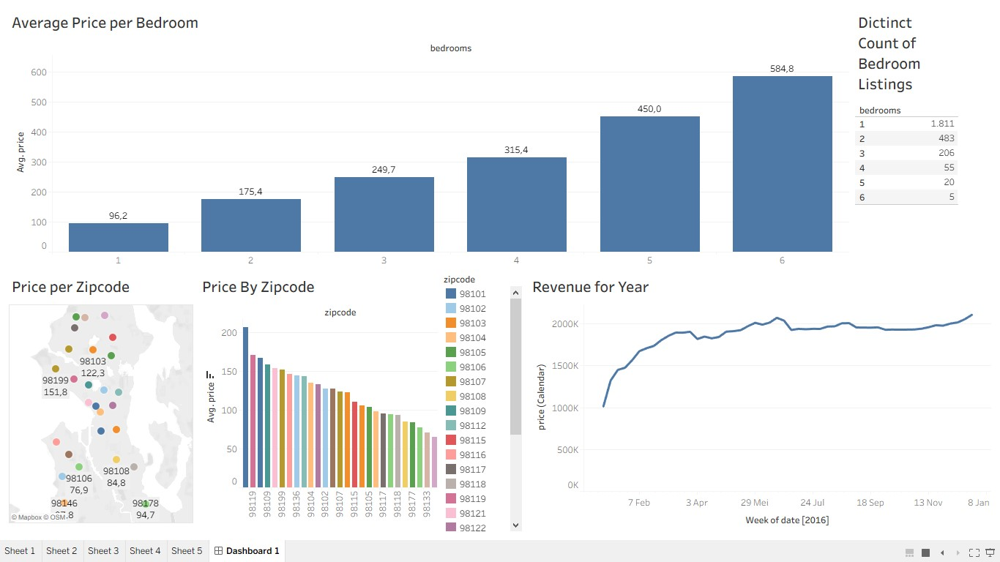

# 📊 Airbnb Seattle data analytics dashboard

[Dashboard Public](https://public.tableau.com/views/AirBnBProject_17815915377440/Dashboard1?:language=en-US&publish=yes&:sid=&:redirect=auth&:display_count=n&:origin=viz_share_link)

## 🚀 Overview

Building an **Airbnb Seattle data analytics dashboard** to help anyone looking to start an Airbnb rental business — identifying the best locations, the best times, and the most profitable property types.

The dashboard tells the story of an Airbnb rental business, revealing:
The Airbnb Business Case
- Where are the best locations for an Airbnb business in Seattle? And what rates should be charged?
- What are the highest and lowest Airbnb rental prices by postcode in the Seattle area?
- When is the best time to list or market an Airbnb property so that it can be booked by guests?
- What is the return on investment for an Airbnb property based on the number of bedrooms?
- How can you assess the level of competition for property listings based on the number of bedrooms?

> 📌 Designed with interactivity, clarity, and real-world decision-making in mind, this dashboard empowers analysts, managers, and stakeholders to unlock the *why* behind the numbers.

---

## 📦 Dataset Details

 **Source**: [Kaggle - Airbnb Listings 2016 Dataset](https://www.kaggle.com/datasets/alexanderfreberg/airbnb-listings-2016-dataset)
 
 [Airbnb data](https://insideairbnb.com/get-the-data/)
 
 About this file
|Table         | Row                                 | Column |
|---------------|------------------------------------|--------|
| **Calendar**   | 1048575 | 4 |
| **Listings**  | 3818        | 92 |
| **Reviews**    | 84849           | 6 |

🧹 Data Cleaning and preprocessing were performed in **Excel** before visualization.

---

## 📊 Visualizations

### 1. Bar Chart — Price by Zip Code
Displays the average nightly price for each zip code, sorted from highest to lowest, with a unique color per zip code.

**Insight:** Zip code `98134` leads with an average of **$206/night**.

---

### 2. Map — Location & Price Distribution
A geographic visualization of all zip codes across Seattle, using the same color scheme as the bar chart, with average price labels displayed on each area.

**Insight:** Helps investors visually identify which neighborhoods command premium pricing.

---

### 3. Time Series — Weekly Revenue
A line chart built from the `calendar` table showing total Airbnb revenue trends per week throughout 2016.

**Insight:**
- 📈 Peak seasons: **summer** and **November–December** (holidays)
- 📉 Slowest period: **January–February**

---

### 4. Bar Chart — Average Price by Number of Bedrooms
Shows the relationship between the number of bedrooms and the average nightly price.

**Insight:** Properties with **5–6 bedrooms** command significantly higher nightly rates compared to 1–2 bedroom units.

---

### 5. Bar Chart — Number of Listings by Bedroom Count
Shows how many properties exist in each bedroom category, representing the level of market competition.

**Insight:**

| Bedrooms | Listings | Competition |
|---|---|---|
| 1 bedroom | 1,800+ | Very high |
| 2 bedrooms | 783 | High |
| 3 bedrooms | 206 | Medium |
| 4 bedrooms | 55 | Low |
| 5 bedrooms | 20 | Very low |
| 6 bedrooms | 5 | Minimal |

---

## 💡 Key Insights for Investors

| Aspect | Recommendation |
|---|---|
| 📍 **Best location** | Zip code `98134` — average $206/night |
| 🗓️ **Best time to rent** | Summer & November–December |
| 🏠 **Ideal property type** | 5–6 bedrooms: high price + low competition = optimal ROI |

---

## 🛠️ Tools & Technologies Used

| Tool          | Purpose                            |
|---------------|------------------------------------|
| **Tableau**   | Visualization & Dashboard Building |
| **MS Excel**  | Data Cleaning & Structuring        |
| **Kaggle**    | Source of Retail Dataset           |

---
